# Voice Input Architecture - Complete System Flow

## 🎤 Voice Input Feature Overview

The system now supports **multilingual voice input** in Telugu, Hindi, and English, allowing users to speak their queries naturally instead of typing.

---

## 📊 Complete Architecture Diagram (Mermaid)

```mermaid
flowchart TB
    %% Voice Input Module
    subgraph VoiceInput["🎤 Voice Input Module (NEW)"]
        direction TB
        A1[👤 User Speaks<br/>Telugu/Hindi/English]
        A2[🎤 Microphone Handler<br/>getUserMedia API]
        A3[🌐 Language Selector<br/>te-IN / hi-IN / en-US]
        A4[🗣️ Web Speech API<br/>webkitSpeechRecognition]
        A5[📊 Acoustic Analysis<br/>Feature Extraction]
        A6[🧠 Language Model<br/>Google Cloud Speech]
        A7[✍️ Text Transcription<br/>Real-time Output]
        A8[📝 Text Normalization<br/>Auto-populate Field]
        
        A1 --> A2
        A2 --> A3
        A3 --> A4
        A4 --> A5
        A5 --> A6
        A6 --> A7
        A7 --> A8
    end
    
    %% Input Module
    subgraph InputModule["📥 Input Module"]
        direction TB
        B1[👤 User Prompt<br/>Text or Voice-generated]
        B2[📝 Natural Language Query]
    end
    
    %% Similarity Index Module
    subgraph SimilarityModule["🔍 Similarity Index Module"]
        direction TB
        C1[🧬 Embedding Generator<br/>sentence-transformers]
        C2[🔎 Search in Database<br/>FAISS Vector DB]
        C3[📊 Similarity Computation<br/>L2 Distance]
        C4[✅ Threshold Checker<br/>70% threshold]
        
        C1 --> C2
        C2 --> C3
        C3 --> C4
    end
    
    %% Entity Swapping Module
    subgraph EntitySwap["⚡ Entity Swapping Module (ENHANCED)"]
        direction TB
        D1[🏷️ Named Entity Recognition<br/>Numbers, Strings, Dates]
        D2[🗺️ Entity Mapping<br/>Original → New]
        D3[📋 Column Detection<br/>Request vs Cached]
        D4[🔧 SQL Structure Adapter<br/>SELECT clause modification]
        D5[📝 Rule-Based Slot Filling<br/>Regex replacement]
        D6[✓ Validation & Refinement<br/>Schema validation]
        
        D1 --> D2
        D2 --> D3
        D3 --> D4
        D4 --> D5
        D5 --> D6
    end
    
    %% LLM Selection
    subgraph LLMSelect["🤖 Select LLM"]
        direction TB
        E1[💻 Local LLM<br/>Ollama Models]
        E2[🌐 Non-Local LLM<br/>Google Gemini]
    end
    
    %% SQL Generation & Execution
    subgraph SQLExecution["⚙️ SQL Execution Module"]
        direction TB
        F1[📋 SQL Validator<br/>Syntax check]
        F2[🔧 Query Executor<br/>DB Engine Connector]
        F3[📊 Result Fetcher<br/>Data retrieval]
        F4[💾 Result Formatter<br/>JSON/Table format]
        F5[⚠️ Error Handler<br/>Exception management]
        
        F1 --> F2
        F2 --> F3
        F3 --> F4
        F2 -.->|Error| F5
    end
    
    %% Visualization Module
    subgraph Visualization["📈 Visualization Module"]
        direction TB
        G1[📥 Input Handler<br/>Result data]
        G2[🔄 Data Preprocessor<br/>Transform & clean]
        G3[📊 Visualization Generator<br/>Charts & graphs]
        G4[🖼️ Output Renderer<br/>Display results]
        
        G1 --> G2
        G2 --> G3
        G3 --> G4
    end
    
    %% Vector Database
    subgraph VectorDB["💾 Vector Database"]
        direction TB
        H1[🗄️ FAISS Index<br/>query_cache.faiss]
        H2[📋 Metadata Store<br/>query_metadata.json]
        H3[💾 Persistent Storage<br/>Disk-based cache]
    end
    
    %% Result Display
    I1[🖥️ Result Display<br/>Web Interface]
    
    %% Main Flow Connections
    A8 -->|Normalized Text| B1
    B1 --> B2
    B2 --> C1
    
    C4 -->|Match Found<br/>≥70%| D1
    C4 -->|No Match<br/><70%| E1
    C4 -->|No Match<br/><70%| E2
    
    D6 -->|Adapted SQL<br/>Instant 0.1s| F1
    E1 -->|Generated SQL<br/>2-5s| F1
    E2 -->|Generated SQL<br/>2-5s| F1
    
    F4 --> G1
    G4 --> I1
    F5 -.->|Error Message| I1
    
    %% Vector DB Connections
    C2 <--> VectorDB
    D6 -->|Store Query| H1
    D6 -->|Store Metadata| H2
    
    %% Styling
    classDef voiceStyle fill:#e1f5fe,stroke:#01579b,stroke-width:3px
    classDef newFeature fill:#fff9c4,stroke:#f57f17,stroke-width:2px
    classDef enhanced fill:#f3e5f5,stroke:#4a148c,stroke-width:2px
    
    class VoiceInput voiceStyle
    class A1,A2,A3,A4,A5,A6,A7,A8 newFeature
    class D3,D4 enhanced
```



---

## 🔄 Detailed Flow Explanation

### **Phase 1: Voice Input (NEW Feature)**

1. **User Speaks** 🗣️
   - User clicks microphone button
   - Selects language: Telugu (te-IN), Hindi (hi-IN), or English (en-US)
   - Speaks query naturally

2. **Microphone Handler** 🎤
   ```javascript
   navigator.mediaDevices.getUserMedia({ audio: true })
   ```
   - Requests browser microphone permission
   - Captures audio stream in real-time
   - Audio format: PCM, 16kHz sample rate

3. **Language Selector** 🌐
   - User pre-selects language from dropdown
   - Language code set: `te-IN` | `hi-IN` | `en-US`
   - Configures speech recognition engine

4. **Web Speech API** 🗣️
   ```javascript
   recognition = new webkitSpeechRecognition()
   recognition.lang = selectedLanguage
   recognition.start()
   ```
   - Browser-based speech recognition
   - Uses Google Cloud Speech backend
   - No server-side processing needed

5. **Acoustic Analysis** 📊
   - Audio waveform → MFCC features (Mel-frequency cepstral coefficients)
   - Phoneme detection
   - Noise filtering

6. **Language Model Processing** 🧠
   - Hidden Markov Models (HMM) for acoustic patterns
   - N-gram language models for word prediction
   - Context-aware transcription

7. **Text Transcription** ✍️
   - Final text output in selected language
   - Example (Telugu): "వేతనం 60000 కంటే ఎక్కువ ఉన్న ఉద్యోగులను చూపించు"
   - Example (Hindi): "60000 से अधिक वेतन वाले कर्मचारियों को दिखाएं"
   - Example (English): "Show employees with salary greater than 60000"

8. **Text Normalization** 📝
   - Text auto-populated into query textarea
   - Special characters handled
   - UTF-8 encoding preserved

---

### **Phase 2: Input Module (Existing - Enhanced)**

- **Accepts two input types:**
  - Manual text input (keyboard)
  - Voice-generated text (from Voice Input Module)
- **Output:** Natural language query string

---

### **Phase 3: Similarity Index Module**

**Workflow:**
1. **Embedding Generator** → Convert query to 384-dim vector using `all-MiniLM-L6-v2`
2. **Search in Database** → FAISS vector similarity search
3. **Similarity Computation** → Calculate: `similarity = 1 / (1 + L2_distance)`
4. **Threshold Checker** → Check if similarity ≥ 70%

**Outcomes:**
- ✅ **Match Found (≥70%)** → Go to Entity Swapping Module
- ❌ **No Match (<70%)** → Go to LLM Selection

---

### **Phase 4: Entity Swapping Module (ENHANCED)**

**NEW: Intelligent Column Adaptation**

1. **Named Entity Recognition**
   - Extract numbers: `\b\d+(?:\.\d+)?\b`
   - Extract strings: `'([^']*)'` or `"([^"]*)"`
   - Extract dates/times

2. **Entity Mapping**
   - Map original entities → new entities
   - Example: 70000 → 60000, 'HR' → 'Engineering'

3. **Column Detection** ⭐ NEW
   ```python
   column_pattern = r'\b(name|age|salary|department|email|phone|id|hire_date|experience)\b'
   orig_columns = extract(original_query)  # ['*'] or ['id', 'name', 'salary']
   new_columns = extract(new_query)        # ['name', 'age']
   ```

4. **SQL Structure Adapter** ⭐ NEW
   ```python
   if has_column_change:
       # Replace SELECT * with specific columns
       adapted_sql = re.sub(r'SELECT\s+\*', f'SELECT {columns}', original_sql)
   ```

5. **Rule-Based Slot Filling**
   - Regex replacement with boundary matching
   - Preserve UPPER() case-insensitive wrappers

6. **Validation & Refinement**
   - Validate columns exist in schema
   - Handle column name variations (experience → experience_years)

**Output:**
```python
{
    'adapted_sql': 'SELECT age, name FROM employees WHERE salary > 60000',
    'swapped': True,
    'structural_change': False,  # Only aggregations now
    'message': '✅ Columns adapted and entities swapped successfully'
}
```

**Performance:** ⚡ **0.1 seconds** (instant)

---

### **Phase 5: LLM Selection (if no match)**

**Option A: Local LLM (Ollama)**
- Models: llama3.2, phi4-mini, gemma, mistral, etc.
- Processing time: 2-5 seconds
- Runs locally on user's machine

**Option B: Non-Local LLM (Google Gemini)**
- Model: gemini-2.0-flash
- Processing time: 2-3 seconds
- Cloud-based processing

---

### **Phase 6: SQL Execution Module**

1. **SQL Validator** → Syntax check, SQL injection prevention
2. **Query Executor** → Execute on SQLite database
3. **Result Fetcher** → Retrieve data rows
4. **Result Formatter** → Convert to JSON/table format
5. **Error Handler** → Catch and report errors

---

### **Phase 7: Visualization Module**

1. **Input Handler** → Receive result data
2. **Data Preprocessor** → Transform and clean data
3. **Visualization Generator** → Auto-detect chart type (bar/pie/line)
4. **Output Renderer** → Display interactive charts

---

### **Phase 8: Vector Database (Persistent Storage)**

**Components:**
1. **FAISS Index** (`data/query_cache.faiss`)
   - Stores 384-dim embedding vectors
   - Fast similarity search (L2 distance)

2. **Metadata Store** (`data/query_metadata.json`)
   ```json
   {
     "natural_query": "Show employees with salary > 70000",
     "sql_query": "SELECT * FROM employees WHERE salary > 70000",
     "timestamp": "2025-10-20T15:30:00",
     "execution_time": 0.023
   }
   ```

3. **Persistent Storage**
   - Survives server restarts
   - Grows smarter over time
   - Automatic backup and retrieval

---

## 🆕 What Changed with Voice Input?

### **Before (Text-only):**
```
User types → Input Module → Similarity Check → Process
```

### **After (Voice + Text):**
```
User speaks → Voice Module → Text Output → Input Module → Similarity Check → Process
       OR
User types → Input Module → Similarity Check → Process
```

### **Key Benefits:**
✅ Multilingual support (3 languages)
✅ Hands-free operation
✅ Natural interaction
✅ No backend changes needed
✅ Browser-based processing (fast)
✅ Seamless integration with existing pipeline

---

## 🎯 Performance Metrics

| Operation | Time | Location |
|-----------|------|----------|
| Voice Recognition | 1-2s | Browser (Google Cloud) |
| Text Normalization | <0.01s | Frontend JS |
| Similarity Search | 0.05s | Backend (FAISS) |
| Entity Swapping | 0.05s | Backend (Python) |
| **Total (Voice → Adapted SQL)** | **~1.5s** | **End-to-end** |
| LLM Generation (if no match) | 2-5s | Local/Cloud |

---

## 🔐 Security & Privacy

- **Microphone permission:** Required by browser
- **Audio processing:** Handled by browser (Google Cloud Speech API)
- **No audio storage:** Audio is not saved anywhere
- **Text-only transmission:** Only transcribed text sent to backend
- **Privacy:** Voice data never touches your server

---

## 🌐 Supported Languages

| Language | Code | Example Query |
|----------|------|---------------|
| Telugu | `te-IN` | "వేతనం 60000 కంటే ఎక్కువ ఉన్న ఉద్యోగులను చూపించు" |
| Hindi | `hi-IN` | "60000 से अधिक वेतन वाले कर्मचारियों को दिखाएं" |
| English | `en-US` | "Show employees with salary greater than 60000" |

---

## 📚 Technical Stack

### **Voice Input:**
- Web Speech API (webkitSpeechRecognition)
- Browser microphone API (getUserMedia)
- Google Cloud Speech (backend)

### **Similarity & Caching:**
- FAISS (Facebook AI Similarity Search)
- sentence-transformers (all-MiniLM-L6-v2)
- Python regex for entity extraction

### **Column Adaptation:**
- Regex pattern matching
- SQL AST manipulation
- Schema validation

### **LLM Integration:**
- Ollama (local models)
- Google Gemini API (cloud)

---

## 🚀 Future Enhancements

1. **Offline voice recognition** (using TensorFlow.js)
2. **Custom wake word** ("Hey SQL Agent...")
3. **Voice feedback** (text-to-speech responses)
4. **Accent adaptation** (regional dialect support)
5. **Continuous conversation** (follow-up queries)

---

*Last Updated: October 20, 2025*
